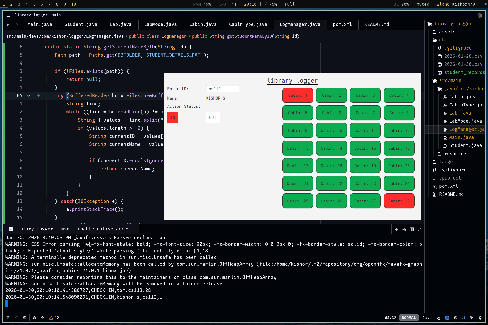

# Library Lab Logger

**Version:** v0.0.11 (GUI Beta)



### App Definition
**Library Lab Logger** is a digital tracking engine designed to manage student check-ins, check-outs, and real-time cabin availability in computer labs. It replaces manual ledgers with an interactive visual dashboard and automatic data logging.

---

### Key Features
* **Visual Dashboard:** Interactive grid showing real-time occupancy (Green = Empty, Red = Occupied).
* **Data Persistence:** Automatic daily CSV logging (`db/YYYY-MM-DD.csv`) for auditing.
* **Dual Mode:** Defaults to a GUI but supports a lightweight CLI for low-resource environments.

### Project Structure
* `Main.java`: Entry point handling the GUI lifecycle and CLI fallback.
* `Lab.java`: Core logic engine and single source of truth.
* `LogManager.java`: Handles persistent file I/O operations.

---

### How to Run

**Prerequisites:** Java JDK 17+ and Apache Maven.

1.  **Install Maven (Arch Linux):**
    ```bash
    sudo pacman -S maven
    ```

2.  **Build Project:**
    ```bash
    mvn clean compile
    ```

3.  **Run Application (GUI Default):**
    ```bash
    mvn exec:java -Dexec.mainClass="com.kishor.logger.Main"
    ```

    *(Optional) Run in CLI Mode:*
    ```bash
    mvn exec:java -Dexec.mainClass="com.kishor.logger.Main" -Dexec.args="--cli"
    ```

---

### Usage Guide

**GUI Controls**
1.  **Enter ID:** Type the Student ID in the text field.
2.  **Select Cabin:** Click any **Green** (Empty) button in the grid.
3.  **Process:** The system automatically logs the entry/exit based on the ID's current status.

**Shortcuts**
* `Ctrl + F`: Toggle Full Screen

**Student Records**
* Student records are stored in `db/student_records.csv`
> **Note:** A Sample data of two entries are included in the repo. Modify this with your custom record.

**Data Logs**
Daily logs are stored in the `db/` folder in the project root.
* **Format:** `YYYY-MM-DD.csv`
* **Content:** Time-stamped records of every event.
